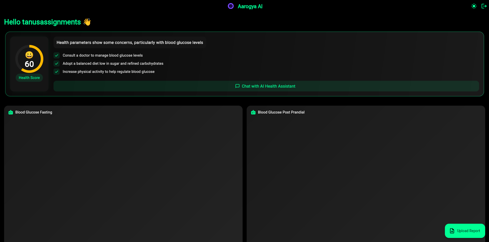
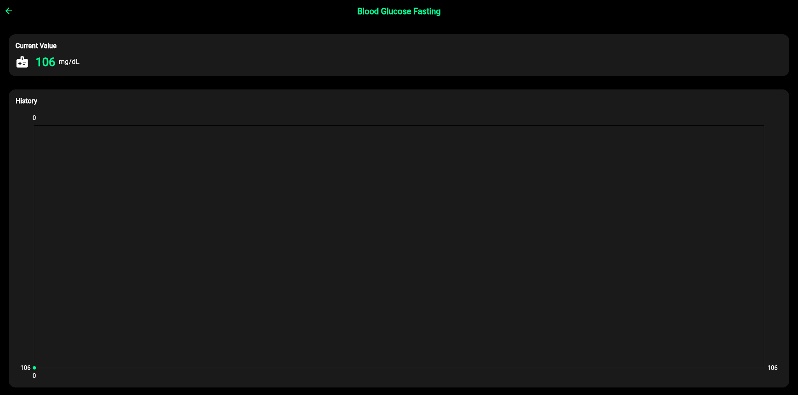
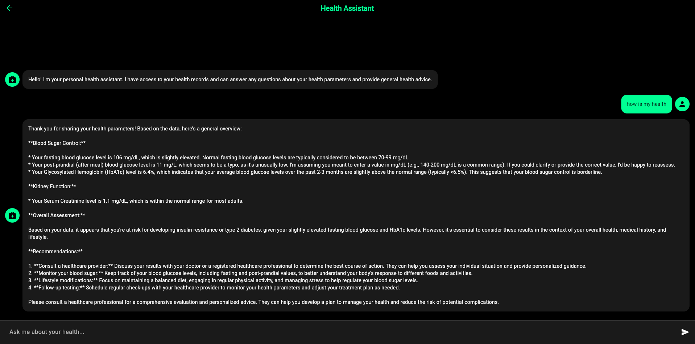
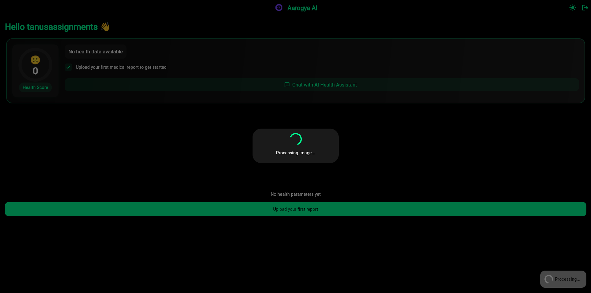

# Aarogya AI 

A Flutter-based AI-powered health tracking application that helps users monitor their health parameters and get personalized health insights.

##  Live Demo

**[https://aarogya-ai.web.app](https://aarogya-ai.web.app)**

##  Features

- ** Health Parameter Tracking** - Upload medical reports and automatically extract health parameters like blood glucose, hemoglobin, cholesterol, etc.
- ** AI Health Assistant** - Chat with an AI assistant that has access to your health data and provides personalized health advice
- ** Health Score** - Get an overall health score based on your parameters with actionable recommendations
- ** Historical Trends** - View historical data and trends for each health parameter
- ** Secure Authentication** - User authentication powered by Supabase
- ** Dark/Light Mode** - Toggle between dark and light themes

##  Screenshots

### Dashboard


### Health Parameter Details


### AI Health Assistant


### Report Processing


##  Tech Stack

- **Frontend**: Flutter (Web, iOS, Android)
- **Backend**: Supabase (Authentication, Database)
- **AI**: Groq API (LLaMA model for health analysis)
- **OCR**: Tesseract.js (for extracting text from medical reports)
- **Hosting**: Firebase Hosting

##  Getting Started

### Prerequisites

- Flutter SDK (3.0+)
- Dart SDK
- A Supabase account
- A Groq API key

### Installation

1. Clone the repository:
   ```bash
   git clone https://github.com/YOUR_USERNAME/aarogya-ai.git
   cd aarogya-ai
   ```

2. Install dependencies:
   ```bash
   flutter pub get
   ```

3. Set up environment variables:
   ```bash
   cp .env.example .env
   ```
   Then edit `.env` and add your API keys:
   - Get Supabase URL and Anon Key from [Supabase Dashboard](https://app.supabase.com) → Settings → API
   - Get Groq API Key from [Groq Console](https://console.groq.com)

4. Run the app (for development):
   ```bash
   flutter run -d chrome \
     --dart-define=SUPABASE_URL=your_supabase_url \
     --dart-define=SUPABASE_ANON_KEY=your_supabase_anon_key \
     --dart-define=GROQ_API_KEY=your_groq_api_key
   ```

### Building for Production

```bash
flutter build web \
  --dart-define=SUPABASE_URL=your_supabase_url \
  --dart-define=SUPABASE_ANON_KEY=your_supabase_anon_key \
  --dart-define=GROQ_API_KEY=your_groq_api_key
```

**Tip:** Create a build script to avoid typing the keys every time.

##  Project Structure

```
lib/
├── main.dart              # Main app entry point, UI components
├── services/
│   ├── ocr_service.dart   # OCR text extraction service
│   └── report_processor.dart  # Medical report processing
```

##  Database Schema

### health_parameters
| Column | Type | Description |
|--------|------|-------------|
| id | uuid | Primary key |
| user_id | uuid | User reference |
| name | text | Parameter name |
| unit | text | Measurement unit |
| value | double | Current value |
| history | jsonb | Historical values |
| last_updated | timestamp | Last update time |

## Contributing

Contributions are welcome! Please feel free to submit a Pull Request.

##  License

This project is licensed under the MIT License.

## 👨 Author

Built with ❤️ using Sreeyansh
